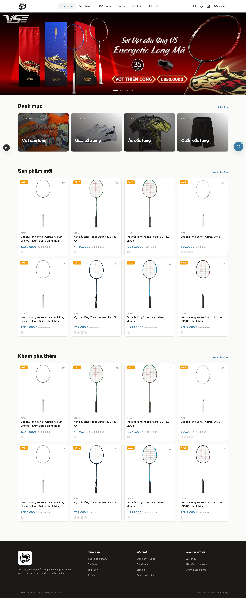
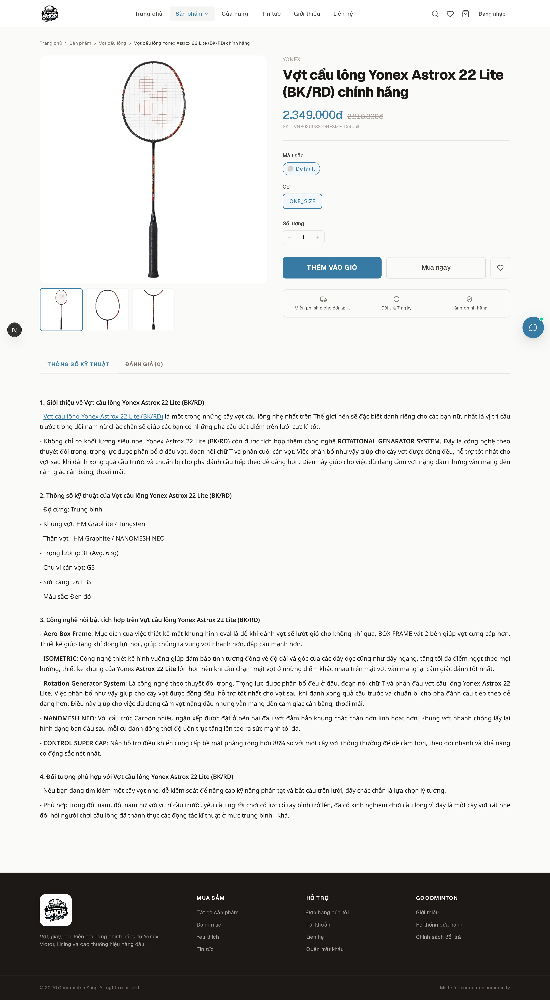
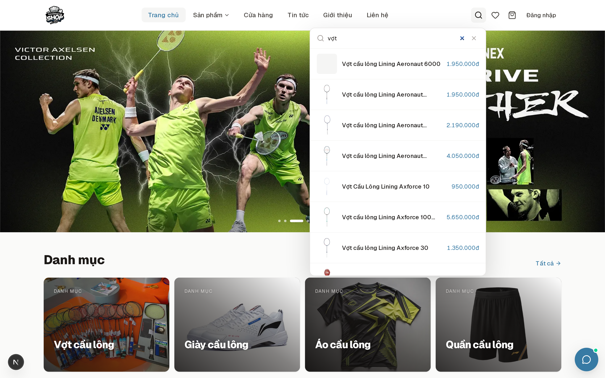
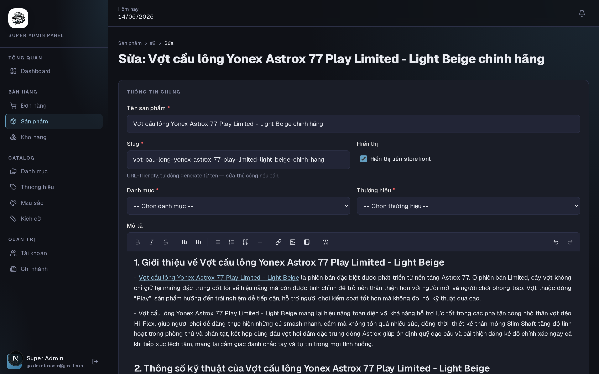
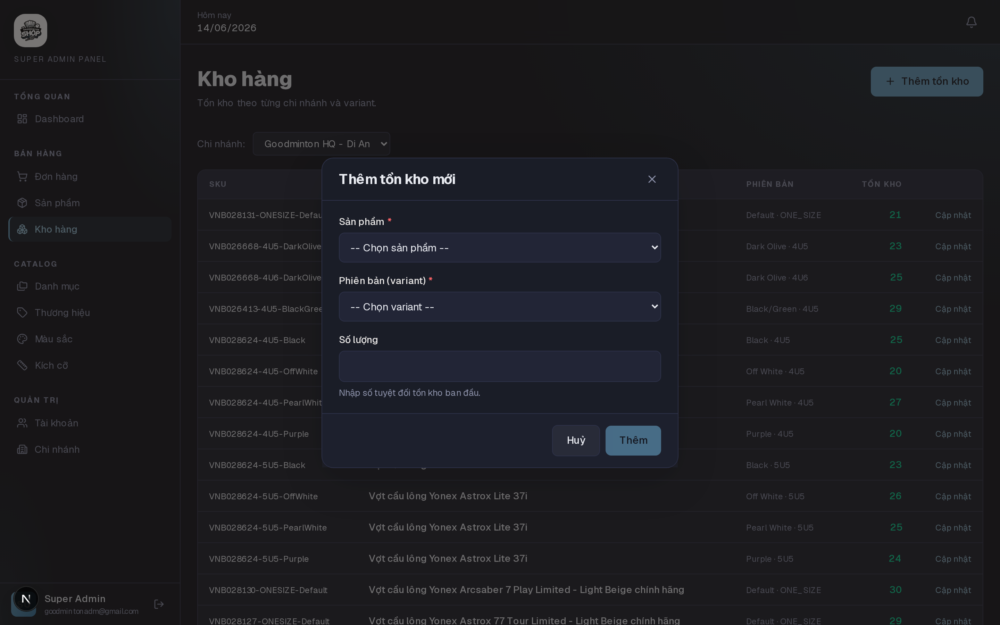
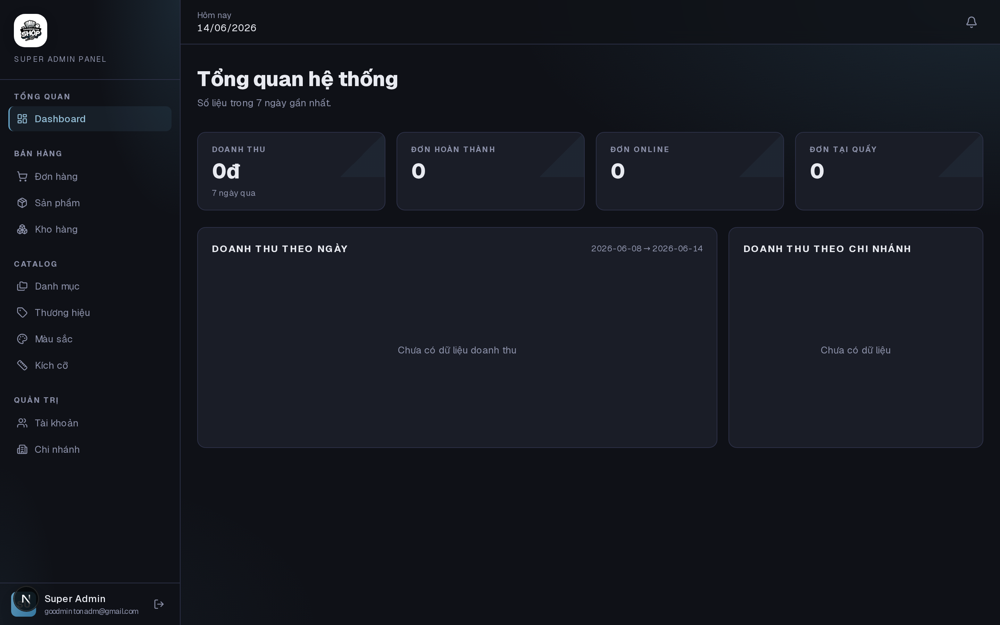
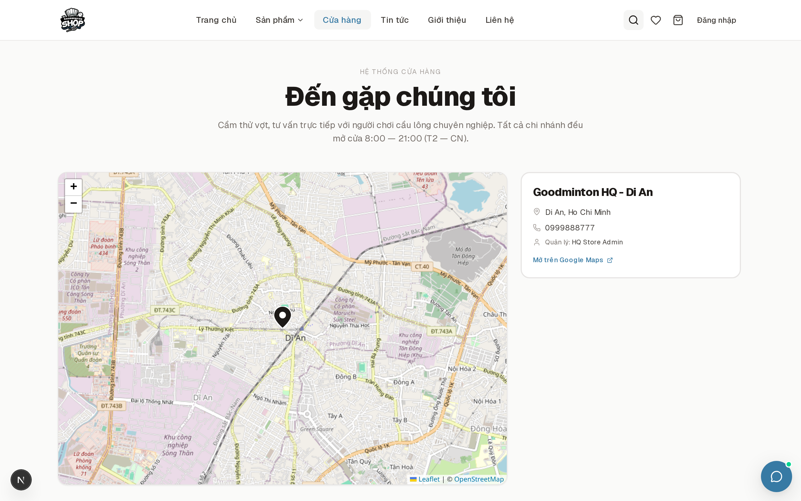
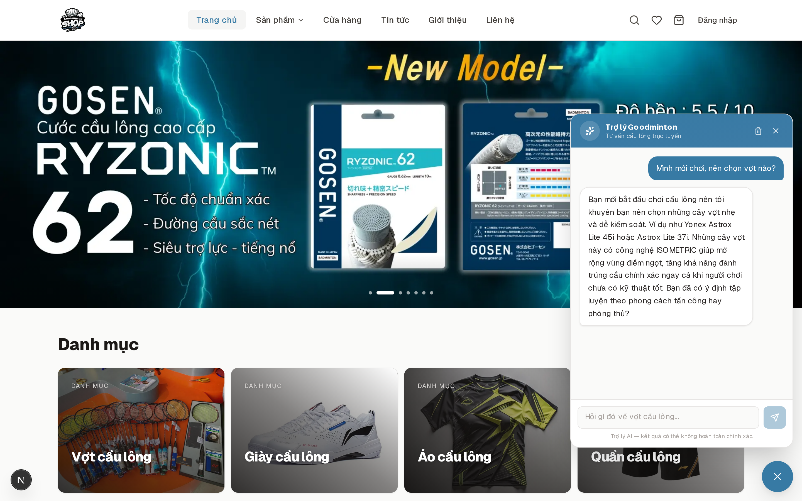

# Goodminton Shop — Frontend

Next.js storefront + admin console for a Vietnamese badminton ecommerce platform. Three personas share one codebase: **customers**, **store admins**, and **super admins** — each gets its own UI, route group, and permission gate.

## Tech stack

- **Next.js 16** (App Router, Turbopack) + **React 19**
- **Bun** (package manager + dev runtime)
- **Tailwind CSS v4** (CSS-first config, no `tailwind.config.ts`)
- **Geist** typography (sans + tabular numerals — single typeface, no extra font load)
- **TanStack Query v5** for server state, cache invalidation, optimistic updates
- **Zustand** with `persist` middleware for cart, wishlist, recently-viewed, auth
- **React Hook Form** + **Zod** for typed forms with cross-field validation
- **TipTap** for the admin rich-text editor (HTML output, images + YouTube/Vimeo embeds)
- **Recharts** for admin dashboard analytics
- **Leaflet + OpenStreetMap** for the store locator map (zero API-key cost)
- **DOMPurify** for safe rendering of HTML descriptions
- Backend: Spring Boot at `:8080` for shop API + FastAPI at `:8081` for the RAG chatbot

## Highlights

### Homepage — hero slider + dynamic category tiles

7-slide auto-advancing hero (pause on hover, touch-swipe, dot pagination, `priority` for LCP). Category tiles render Cloudinary thumbnails with a gradient overlay so the title stays legible on any image.



### Product detail — gallery, variants, reviews

Image gallery driven by product thumbnail + selected variant images, color/size chip selector, inline review composer that auto-detects eligible `orderItem` (completed order, not yet reviewed), and a rating summary with distribution histogram.



### Backend-powered search + autocomplete

Header search hits `/api/search/products/suggest` (Postgres FTS + trigram fuzzy + `unaccent`). The `/products` page swaps to `/api/search/products` whenever a query is present — no client-side filtering of large lists. Admin pages (products, accounts, stores, categories, brands) share the same pattern via a reusable search bar.



### Order tracking — clear progress states

6-step timeline with active-state pulse, completed-state filled icons, gradient connectors. Mobile collapses to a vertical stack to keep all steps legible on small screens.

### Admin product editor — TipTap rich text

Full WYSIWYG for product descriptions with image (URL) + YouTube/Vimeo embed. Output HTML is sanitized via DOMPurify (iframes restricted to YouTube/Vimeo hosts by a custom DOMPurify hook). The storefront renders descriptions via the exact same `.rich-text` CSS, so admin preview matches public output 1:1.



### Inventory management per store

Store admins manage their own inventory (CRUD with backend ownership check). Super admins manage any store. Variant picker filters out variants already stocked at the store to prevent duplicate inventory rows.



### Admin dashboard

Recharts-driven analytics: revenue-by-date area chart, revenue-by-store bar chart, key KPIs (total revenue, completed orders, online vs in-store split), low-stock alerts.



### Store locator with Leaflet

Map view of all physical stores, click-to-focus markers, scroll-to-card sync, "Open in Google Maps" link per store. "HQ" badge for the central store.



### RAG chatbot

Floating widget on every storefront page. Calls the FastAPI RAG service for grounded shopping advice — product recommendations, real-time price + inventory lookups (tool-calling into the shop API), warranty & return policies. Persists chat history to `localStorage`, sends a rolling 20-message context, custom 60s timeout with friendly error messages.



## Architecture

```
app/
├── (auth)/             # /login, /register, /admin/login
├── (storefront)/       # customer-facing: /, /products, /cart, /checkout, /orders, /stores
├── admin/(panel)/      # super-admin: dashboard, catalog, orders, stores, accounts, inventories
└── store-admin/(panel) # store-admin: dashboard, orders, inventory, POS
```

Route groups give each persona its own layout, header/sidebar, and auth guard. The `StorefrontAuthGuard` force-logs-out admin sessions that leak onto the storefront. `RequireAuth roles={[...]}` gates protected routes.

```
components/
├── admin/           # admin-only: DataTable, AdminPageHeader, ProductForm, InventoryFormModal, …
├── auth/            # RequireAuth, RedirectIfAuthed, StorefrontAuthGuard
├── chatbot/         # floating widget + panel + API client (lazy-loaded)
├── storefront/      # customer-facing: ProductCard, ProductGrid, HeroSlider, ProductGallery, …
├── ui/              # shared primitives: Button, Input, Modal, Spinner, RichTextEditor, HtmlContent
└── map/             # Leaflet wrappers (LocationPicker, StoresMap)

lib/
├── api/             # one file per backend resource (productsApi, ordersApi, searchApi, …)
├── api.ts           # fetch wrapper: JWT auto-attach, single-flight refresh, anonymous retry on 401
└── validation/      # Zod schemas

store/               # Zustand stores: cart, wishlist, recently-viewed, auth, toast, admin-shell
hooks/               # TanStack Query wrappers (useProductList, useMyOrders, useMyStore, …)
types/api.ts         # types mirroring backend response shapes
```

## Getting started

```bash
# Install deps
bun install

# Configure env — see `.env.example`
cp .env.example .env.local
# NEXT_PUBLIC_API_URL=http://localhost:8080
# NEXT_PUBLIC_RAG_API_URL=http://localhost:8081

# Run
bun dev
```

Open <http://localhost:3000>.

Backend services need to be running for full functionality:

- **Spring shop API** on `:8080` — products, orders, inventory, auth, VNPay
- **FastAPI RAG service** on `:8081` — chatbot (optional, widget shows a graceful error if not configured)

## Backend contract

See [`docs/api-docs.md`](docs/api-docs.md) for the full REST contract — pagination shape (Spring Boot 3 `PagedModel`), envelope format (`{ code, result }`), JWT flow, error codes (1xxx–9xxx by domain), and the unified `id` / `xxxId` (PK / FK) field naming convention.

The chatbot integration spec lives in [`docs/guide_chatbot.md`](docs/guide_chatbot.md).

## Key conventions

- **PK = `id`, FK = `xxxId`** in DTOs across the wire. FE types in [`types/api.ts`](types/api.ts) mirror this exactly.
- **Page state is 1-based** on the FE; the FE converts to 0-based for backend endpoints that expect 0-based (e.g. search service).
- **Auth flow**: customers log in at `/login` (rejects admin accounts), admins log in at `/admin/login` (rejects customer accounts). Storefront layout auto-logs-out admin sessions on entry.
- **Comments in English**, kept minimal — explain _why_, not _what_.
- **Readonly props**: React component props are wrapped in `Readonly<...>` (SonarLint S6759).

## Scripts

```bash
bun dev              # dev server with Turbopack
bun build            # production build
bun start            # serve production build
bunx tsc --noEmit    # type-check
```
