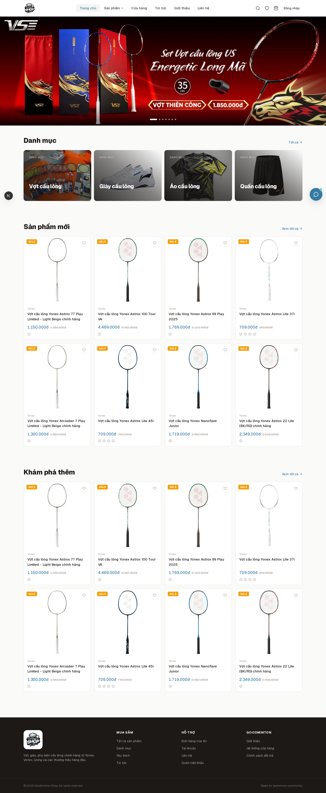
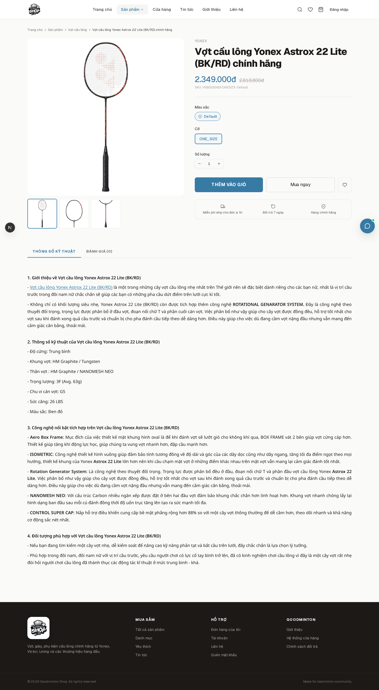
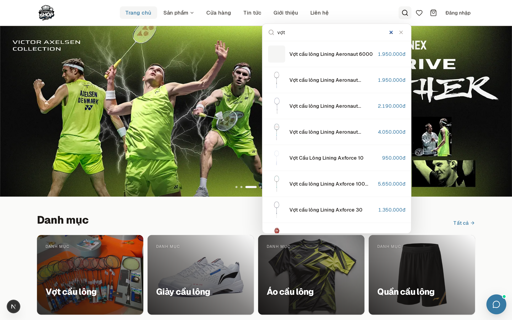
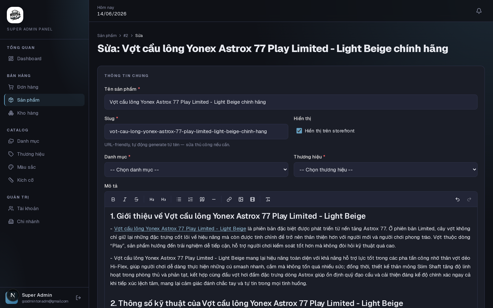
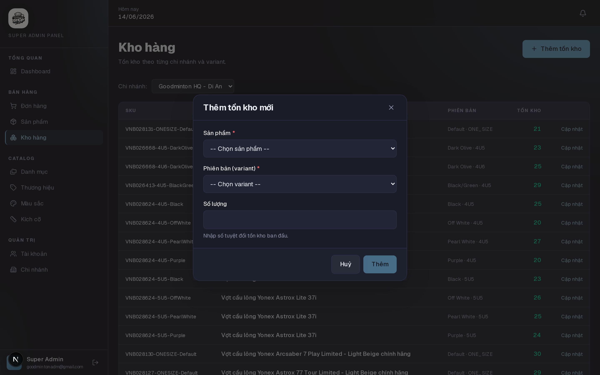
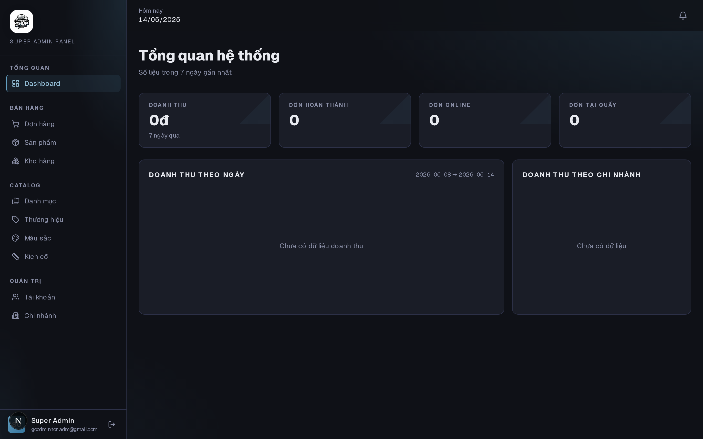
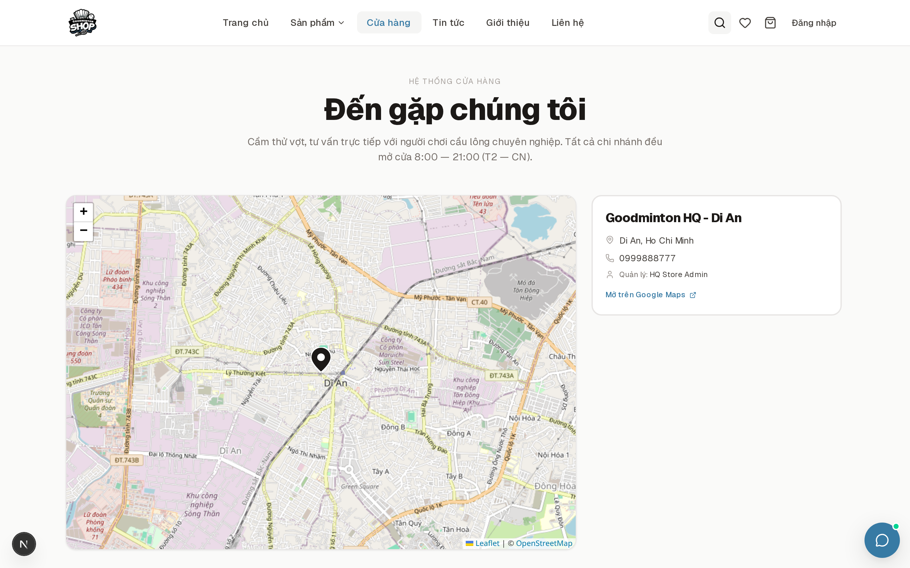
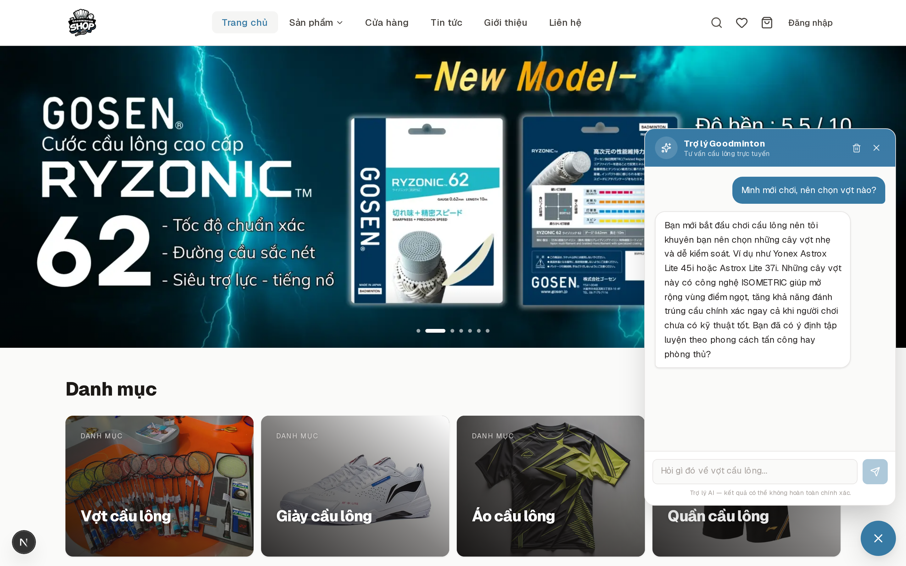

# Goodminton Shop — Frontend

Next.js storefront + admin console for a Vietnamese badminton ecommerce platform. Three personas share one codebase — **customers**, **store admins**, **super admins** — each with its own route group and auth guard.

## Stack

Next.js 16 (App Router, Turbopack) · React 19 · Bun · Tailwind CSS v4 · Geist · TanStack Query v5 · Zustand · React Hook Form + Zod · TipTap · Recharts · Leaflet · DOMPurify.

## Highlights

**Homepage** — auto-advancing 7-slide hero + dynamic category tiles.



**Product detail** — gallery, color/size chip selector, inline review composer that only opens for eligible order items, rating distribution histogram.



**Backend search** — header autocomplete + `/products?q=` both hit Postgres FTS (trigram fuzzy, `unaccent`). Same pattern reused for admin lists.



**Admin TipTap editor** — rich-text descriptions with image/video embed; storefront renders via the exact same CSS so admin preview matches 1:1.



**Inventory** — store admins CRUD their own store; variant picker hides SKUs already stocked to prevent duplicate rows.



**Admin dashboard** — Recharts revenue-by-date + revenue-by-store, KPIs, low-stock alerts.



**Store locator** — Leaflet + OpenStreetMap (zero API-key cost), scroll-sync between marker and card.



**RAG chatbot** — floating widget, calls a FastAPI RAG service for grounded shopping advice with real-time price + inventory tool-calls. History persisted to `localStorage`.



## Getting started

```bash
cp .env.example .env.local   # set NEXT_PUBLIC_API_URL + NEXT_PUBLIC_RAG_API_URL
bun install
bun dev                      # → http://localhost:3000
```

The Spring shop API (`:8080`) must be reachable for anything data-driven. The FastAPI RAG service (`:8081`) is optional — the chatbot widget shows a friendly error when unset.

## Layout

```
app/
├── (auth)/             # login/register/admin-login
├── (storefront)/       # /, /products, /cart, /checkout, /orders, /stores
├── admin/(panel)/      # super-admin: dashboard, catalog, orders, stores, accounts, inventories
├── store-admin/(panel) # store-admin: dashboard, orders, inventory, POS
└── payment/            # PayOS return + cancel pages

components/  admin · auth · chatbot · storefront · ui · map
lib/api/     one file per backend resource + JWT-aware fetch wrapper
store/       Zustand: cart, wishlist, recently-viewed, auth, toast, admin-shell
hooks/       TanStack Query wrappers
```

## Scripts

```bash
bun dev              # dev server (Turbopack)
bun build            # production build
bun start            # serve prod build
bunx tsc --noEmit    # type-check
```
